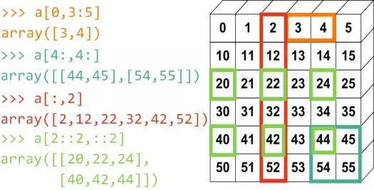

## 一维Array的索引访问
和数组一样：`Array[index]`
## 多维Array的索引访问
和多维数组差不多：`Array[Rindex][Cindex]`、`Array[RIndex, CIndex]`  
`Array[index]`返回第index维的Rarray  
## 切片slice
获取某行：`Array[Rindex]`  
获取某列：`Array.T[index]`  
迭代：`for row in Array: `  
slice: `Array[1, 2:5]`  
多维转一维：`Array.flatten()`  
flat属性：`for item in Array.flat:` *将各个元素迭代出来*  
  
